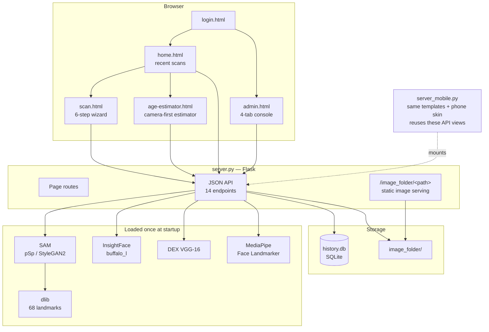
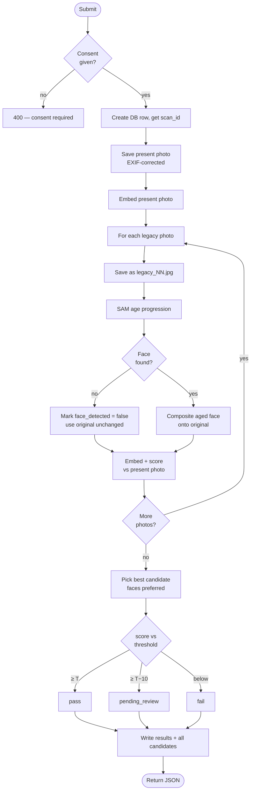
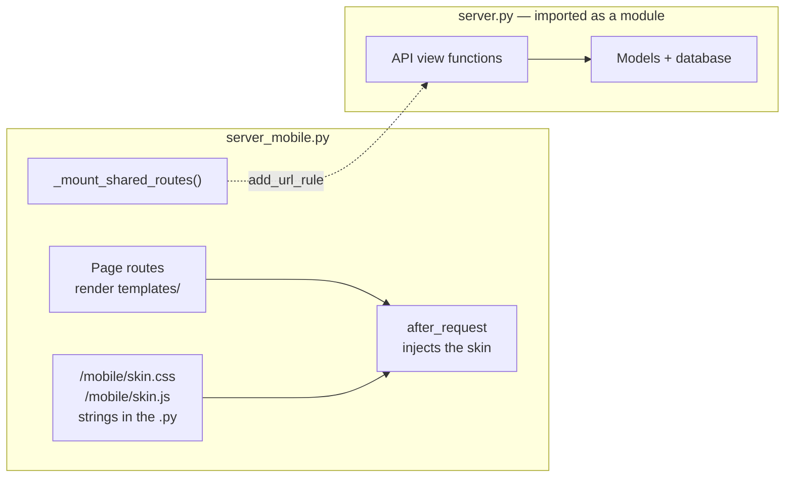

# BS BioShifting — Technical Documentation

Age progression and age-invariant face verification, running entirely offline.

**Version:** documented 2026-08-10 · **Stack:** Python 3 / Flask / PyTorch / ONNX Runtime / SQLite
**Entry points:**
`python server.py` → <http://127.0.0.1:5000> — the desktop build
`python server_mobile.py` → <http://127.0.0.1:5001> — the same application with a phone UI ([section 14](#14-mobile-server))

---

## Table of contents

1. [What the system does](#1-what-the-system-does)
2. [Architecture](#2-architecture)
3. [Installation and startup](#3-installation-and-startup)
4. [The models](#4-the-models)
5. [The scan pipeline, end to end](#5-the-scan-pipeline-end-to-end)
6. [Face-preserving compositing](#6-face-preserving-compositing)
7. [Age estimation and calibration](#7-age-estimation-and-calibration)
8. [Frame quality assessment](#8-frame-quality-assessment)
9. [Verification scoring](#9-verification-scoring)
10. [Data model](#10-data-model)
11. [File storage](#11-file-storage)
12. [HTTP API reference](#12-http-api-reference)
13. [Front end](#13-front-end)
14. [Mobile server](#14-mobile-server)
15. [Module reference](#15-module-reference)
16. [Configuration](#16-configuration)
17. [Maintenance scripts](#17-maintenance-scripts)
18. [Troubleshooting](#18-troubleshooting)
19. [Known limitations](#19-known-limitations)

---

## 1. What the system does

Given an archival photograph of a person (a childhood ID photo, an old print) and a
present-day photograph, the system:

1. Ages the face in the archival photo forward — or backward — to a chosen target age.
2. Extracts face-recognition embeddings from the aged result, the original archival photo,
   and the present-day photo.
3. Scores how similar they are, and decides whether they depict the same person.
4. Routes uncertain cases into an administrator review queue.

The intended use is age-invariant identity verification: confirming that a person is who a
decades-old document claims they are.

Everything runs locally. There is no API key, no third-party upload, and no network access
at runtime — model weights sit on disk and SQLite holds the records.

### Two independent features

The application contains **two separate AI features** that are deliberately not wired together:

| Feature | Where | Purpose |
| --- | --- | --- |
| **Scan / verification** | `/scan` | The six-step pipeline above. The core of the app. |
| **Age estimator** | `/age-estimator` | Standalone "guess this photo's age" tool. Informational only. |

The age estimator is its own page, reached from the **Estimate Photo Age** button on `/home`.
It opens on the live camera — scanning a face is the primary action, uploading a photo the
secondary one — and reports the age of the largest face it finds.

It does **not** feed the scan flow. If you do not know the age in a legacy photo, you use the
estimator and type the number into the wizard yourself. Keeping them separate means an
age-estimation error can never silently corrupt a verification record.

> **The separation is about authority, not about isolation.** The wizard does call
> `/api/estimate-age` on its own — on the primary legacy photo and on the present photo — and
> shows both results on step 4 as hints. The legacy hint carries a **Use this** button that
> fills the field; the present-photo hint is advisory text with no button at all. Either way
> the estimate only ever becomes an input when a human puts it there, so a bad estimate
> cannot silently become part of a verification record.

---

## 2. Architecture



### Design principles observed in the code

- **Single source of truth for paths.** Every image the app writes goes through
  `build_image_path()`. No path string concatenation anywhere else.
- **Graceful degradation.** Each model is loaded in its own `try/except`. A missing
  MediaPipe model disables quality checks but leaves the app usable; a missing DEX model
  disables age estimation and says so, rather than silently falling back to a worse model.
- **Failure containment.** One unusable legacy photo does not abort a multi-photo submission.
- **One implementation, two presentations.** The mobile server imports `server.py` and
  re-registers its API view functions rather than reimplementing them, so the two front ends
  cannot drift apart. See [section 14](#14-mobile-server).

---

## 3. Installation and startup

### Python dependencies

Verified installed versions:

| Package | Version | Used for |
| --- | --- | --- |
| `flask` | 3.1.3 | Web server |
| `torch` | 2.13.0+cpu | SAM and DEX inference |
| `torchvision` | 0.28.0+cpu | Image transforms |
| `opencv-python` (`cv2`) | 5.0.0 | Warping, blending, drawing, image I/O |
| `numpy` | 2.4.2 | Array maths |
| `Pillow` (`PIL`) | 12.3.0 | Image loading, EXIF handling |
| `insightface` | 1.0.1 | Face detection and recognition |
| `onnxruntime` | 1.27.0 | Runs the InsightFace ONNX models |
| `mediapipe` | 0.10.35 | Live frame quality assessment |
| `dlib` | 20.0.0 | 68-point landmarks for FFHQ alignment |
| `scipy` | 1.18.0 | Alignment padding maths |
| `cryptography` | 45.0.3 | Optional — only for `server_mobile.py --https` |

### Required model weights

These are **not** in version control — they total roughly 4.3 GB. See [section 4](#4-the-models)
for what each does.

```
SAM/pretrained_models/sam_ffhq_aging.pt              2.27 GB
SAM/pretrained_models/dex_age_classifier.pth         1.62 GB
SAM/shape_predictor_68_face_landmarks.dat           99.7 MB
face_reaging/face_landmarker.task                   3.76 MB
~/.insightface/models/buffalo_l/                     326 MB  (auto-downloads on first run)
```

The DEX classifier can be fetched with:

```bash
python -c "import gdown; gdown.download(id='1atzjZm_dJrCmFWCqWlyspSpr3nI6Evsh', output='SAM/pretrained_models/dex_age_classifier.pth')"
```

### Running

```bash
python server.py          # desktop build → 127.0.0.1:5000
python server_mobile.py   # phone build   → 127.0.0.1:5001
```

A healthy startup prints five lines — identically for either entry point, because the mobile
server loads the models by importing the desktop one:

```
  [OK] SAM model loaded
  [OK] InsightFace (buffalo_l) loaded
  [OK] Age calibration loaded (14 knots)
  [OK] DEX age classifier loaded
  [OK] MediaPipe FQA loaded
```

Both bind loopback only, with `debug=False` and a 32 MB maximum request body. The desktop
server's host and port are fixed in `app.run`; the mobile server takes `--port` and `--lan`
([section 14](#14-mobile-server)).

Confirm model state at any time via `GET /api/status`.

Loading all five models takes roughly 30 seconds on CPU, so neither server answers a request
immediately after launch.

> **Running both at once is possible but not free.** They are separate processes, so each
> loads its own ~4 GB of weights while sharing `history.db` and `image_folder/` on disk.
> SQLite's WAL mode handles the concurrent access; memory is the constraint. For a demo,
> run whichever build you are showing.

---

## 4. The models

Five models with five distinct, non-interchangeable jobs.

### 4.1 SAM — age progression

`SAM/pretrained_models/sam_ffhq_aging.pt` · 2.27 GB · loaded by `sam_wrapper.py`

"Only a Matter of Style: Age Transformation Using a Style-Based Regression Model". A pSp
encoder over a StyleGAN2 generator, trained on FFHQ-Aging. Takes an aligned 256×256 face
plus a target age, and renders that face at that age.

Inference settings: `randomize_noise=False` (so repeated runs of the same input are
reproducible) and `resize=False`, which means the decoder emits at its **native**
resolution — typically 1024×1024, not the 256×256 that went in. The compositing code reads
the actual output size rather than assuming.

### 4.2 InsightFace buffalo_l — detection and recognition

`~/.insightface/models/buffalo_l/` · 326 MB · ONNX Runtime

| File | Role |
| --- | --- |
| `det_10g.onnx` | SCRFD face detector — bounding boxes and 5-point keypoints |
| `w600k_r50.onnx` | ResNet-50 recognition — 512-dimensional embeddings |
| `genderage.onnx` | **Present but deliberately unused** (see below) |
| `2d106det.onnx`, `1k3d68.onnx` | Dense landmarks, unused by this app |

Detector runs at `det_size=(640, 640)`.

> **Why `genderage.onnx` is not used for age.** It is a tiny attribute head bundled for
> speed, and measurement showed it is unusable as an age estimator. On this project's own
> photos it never predicted below 24: childhood ID photos averaged **29.9** and present-day
> adults averaged **31.3** — it could not separate children from adults at all. DEX replaced
> it for the age number. InsightFace is still used for detection, which it does well.

### 4.3 DEX — age estimation

`SAM/pretrained_models/dex_age_classifier.pth` · 1.62 GB · VGG-16

Deep EXpectation, the ChaLearn LAP winner, trained on IMDB-WIKI and fine-tuned on
FFHQ-Aging. Rather than regressing a single number it outputs a **distribution over 101
classes** (ages 0–100) and takes the softmax-weighted expectation. That is what lets it
handle children properly, and it yields a smooth real-valued age.

These are the same weights SAM uses for its own aging loss, so age estimates stay
conceptually consistent with the progression feature.

Input: 224×224 RGB, ImageNet-normalised (mean `[0.485, 0.456, 0.406]`, std
`[0.229, 0.224, 0.225]`).

### 4.4 dlib — 68-point landmarks

`SAM/shape_predictor_68_face_landmarks.dat` · 99.7 MB

Drives the FFHQ alignment that SAM requires, and — critically — produces the quadrilateral
that makes [face-preserving compositing](#6-face-preserving-compositing) possible.

### 4.5 MediaPipe Face Landmarker — frame quality

`face_reaging/face_landmarker.task` · 3.76 MB

Dense facial landmarks on live camera frames, used for the real-time quality checks in
[section 8](#8-frame-quality-assessment). Configured for up to 2 faces, so it can detect and
reject the "more than one person in frame" case.

---

## 5. The scan pipeline, end to end

### The six wizard steps

| # | Step | What happens |
| --- | --- | --- |
| 1 | **Direction** | Age progression or regression. Asked before any upload, since it frames everything after. Click advances automatically. |
| 2 | **Legacy photo** | Up to 5 archival photos. One is marked primary. |
| 3 | **Present photo** | Opens directly into the live camera with quality checks; upload is offered as a fallback link underneath. |
| 4 | **Age target** | Age in the legacy photo (typed number, not a slider) and target age (slider **and** a typeable number box — it carries a standing outline so the field reads as editable rather than as a slider readout). The legacy field shows an AI estimate with a **Use this** button; the target field shows the estimate from the present photo as information only. Plus optional case name and notes, and the biometric consent checkbox that gates the run. |
| 5 | **Processing** | The server work below, with live progress. |
| 6 | **Results** | Score, verdict, and a drag-slider comparing legacy against aged. |

### Server-side processing (`POST /api/scan/submit`)



### Target-age amplification

The requested age gap is multiplied by **1.5** before reaching the model:

```python
age_gap = target_age - current_age
amplified_target = int(current_age + (age_gap * 1.5))
amplified_target = max(0, min(100, amplified_target))
```

SAM's output at a literal small gap is too subtle to read visually, so aging 10 → 18 is
actually requested as 10 → 22. The **unamplified** target is what gets stored in the
database and shown to the user.

### Best-candidate selection

Every legacy photo is aged and scored independently. The winner is the highest-scoring
candidate — but candidates where a face was actually detected are preferred as a group:

```python
with_face = [c for c in candidates if c["face_detected"]]
pool = with_face or candidates
best = max(pool, key=lambda c: c["cosine"] if c["cosine"] is not None else -1)
```

A photo with no detectable face can therefore never win by default. Every candidate is
still recorded in `scan_legacy_photos` for audit.

---

## 6. Face-preserving compositing

**The problem.** SAM emits a brand-new synthetic face at its own resolution and square
aspect ratio. Using that directly as "the aged photo" throws away the background, clothing,
framing and resolution of the source — it is a different picture of a similar-looking
person, not the same photograph aged.

**The solution.** Age only the face, then put it back exactly where it came from.

### How the geometry is recovered

FFHQ alignment computes a quadrilateral `quad` in the **original image's** coordinate space,
then applies shrink → crop → pad → `Image.QUAD` transform to produce the aligned crop. Those
later steps mutate `quad`. `_align_face_with_quad()` in `sam_wrapper.py` snapshots it
immediately after it is computed and before anything modifies it:

```python
quad_orig = quad.copy()   # taken before shrink/crop/pad
```

Snapshotting early is exact. Reconstructing the original quad afterwards by undoing the
transforms would be arithmetically valid but introduces rounding error, because the shrink
step resizes to `np.rint(size / shrink)` rather than an exact fraction.

### The composite

Because the quad is a parallelogram, three point correspondences fully determine an affine
map — no perspective transform is needed:

```python
src = np.float32([[0, 0], [0, face_h], [face_w, 0]])
dst = np.float32([quad_orig[0], quad_orig[1], quad_orig[3]])
M = cv2.getAffineTransform(src, dst)
```

The blend mask is an **ellipse**, not the full square, feathered with a Gaussian:

```python
ax, ay = face_w * (108/256), face_h * (118/256)   # proportions scale with decoder output
cv2.ellipse(mask, (cx, cy), (ax, ay), 0, 0, 360, 1.0, -1)
mask = cv2.GaussianBlur(mask, (0, 0), sigmaX=18.0 * (face_w / 256.0))
```

The ellipse deliberately excludes the crop's corners, where FFHQ's reflect-padding artefacts
appear for faces near the edge of a photo. It also guarantees the mask is exactly zero at
and beyond the crop boundary, so:

```python
composited = orig * (1 - warped_mask) + warped_face * warped_mask
```

leaves every pixel outside the oval **mathematically identical** to the input — multiplying
by a mask of exactly 0.0 is lossless.

### When no face is found

`_align_face_with_quad` raises `FaceNotFoundError`. The caller returns the original photo
**unchanged** with `face_detected: False`. It never fabricates a synthetic whole-image
result. `/api/scan/submit` catches this per-candidate so one bad photo cannot fail an
entire submission.

---

## 7. Age estimation and calibration

### The pipeline

1. InsightFace detects faces; the largest is the subject, the rest are reported as
   bystanders.
2. For each face, crop at **three margins** — 0.25, 0.40, 0.55 — via `crop_face()`.
3. Run DEX on each crop plus its horizontal mirror (6 forward passes).
4. Average the **probability distributions**, not the scalar ages — averaging distributions
   is better behaved.
5. Take the expectation to get a raw age.
6. Apply the calibration curve.

Confidence is reported as the share of probability mass within ±5 years of the prediction,
so a peaked distribution scores high and a smeared one scores low.

### Why multiple margins

Crop margin is not a cosmetic parameter. Measured on this project's photos:

| Subject | m=0.0 | m=0.2 | m=0.4 | m=0.6 | m=0.8 |
| --- | ---: | ---: | ---: | ---: | ---: |
| child ~6 | 7.2 | 6.1 | 5.8 | 5.5 | 4.9 |
| child ~10 | 4.4 | 7.5 | 9.0 | 9.9 | 9.3 |
| teen ~17 | 29.3 | 24.9 | 18.0 | 16.1 | 14.3 |
| adult ~25 | 24.0 | 23.7 | 24.2 | 24.4 | 22.6 |

The teen moves **15 years** across the range. Any single margin is an arbitrary sample of a
very sensitive parameter; averaging several stabilises it.

### The calibration curve

Raw DEX compresses predictions toward the middle of its range. Measured on 449 stratified
UTKFace images through the production path (MAE 8.6, r = 0.899):

| True age | Bias before |
| --- | ---: |
| `<18` | +1.0 y |
| `18–35` | +0.6 y |
| `36–55` | −7.6 y |
| `>55` | −11.4 y |

> **A caution about bucket averages.** The `18–35` figure above looks unbiased but is not —
> within it, 18–24 reads **+2.3 y** and 25–34 reads **−0.9 y**, and averaging opposite-signed
> errors hides the compression. Always check finer bins before declaring a range unbiased.

**The method matters.** Two curves could be fitted here and they are not the same thing:

- `E[true | pred]` minimises average error, but a conditional mean is inherently regressive —
  it stays compressed and would not fix the symptom.
- **The inverse of `E[pred | true]`** delivers conditional unbiasedness: an 18-year-old reads
  ~18, a 60-year-old reads ~60. This is what is used.

Binning on the true age (which is noise-free) also avoids regression dilution, which makes a
naive slope fit report a meaningless ≈1.0× gain.

Monotonicity is enforced with pool-adjacent-violators so the curve can be inverted.

**Held-out result** (149 unseen faces): overall bias **−5.49 → −0.87 y**, MAE **8.37 → 7.90**.

| Model reads | Now shows |
| ---: | ---: |
| 25 | 23.0 |
| 45 | 56.3 |
| 60 | 70.3 |

**The trade-off.** Inverting a compressed mapping amplifies noise where compression was
strongest. Middle-bucket MAE worsened (18–35: 3.9 → 5.4; 36–55: 7.0 → 8.5) while the ends
improved (>55: 15.3 → 12.4). This was chosen deliberately: the displayed number should look
right across the range rather than minimise average error.

It also reads this project's own photos 1–2 years younger (adult ~25: 25.2 → 23.1), because
that range was already accurate before correction.

**Disabling.** Delete `age_calibration/age_calibration.json` — `calibrate()` becomes the
identity and the app runs on raw predictions. To soften rather than remove it, damp toward
identity: `raw + λ · (calibrate(raw) − raw)` with λ ≈ 0.5–0.7.

**The curve is tied to its margins.** It was fitted with `MARGINS = (0.25, 0.4, 0.55)`,
recorded in the JSON. Change `age_estimator.MARGINS` and you must refit.

---

## 8. Frame quality assessment

Live camera frames are POSTed to `/api/fqa` roughly every 800 ms. Four checks run against
MediaPipe landmarks; the capture button unlocks only when all pass.

| Check | Measures | Thresholds |
| --- | --- | --- |
| **Lighting** | Mean brightness, blown-out and crushed pixel fractions | mean 60–195; blown ≤ 6%; dark ≤ 30% |
| **Sharpness** | Laplacian variance on a width-normalised 256 px crop | ≥ 25.0 |
| **Head pose** | Roll from eye line; yaw from nose position between cheeks; pitch from nose between eyes and chin | roll ≤ 10°; yaw 0.35–0.65; pitch 0.30–0.62 |
| **Framing** | Eye-centre position and face width as a fraction of frame | eye x 0.33–0.67, y 0.25–0.55; face width 0.22–0.75 |

Landmark indices used: eyes `33`/`263`, nose tip `1`, chin `152`, cheeks `234`/`454`.

Rejections return a specific instruction — "Lower your chin slightly", "Move closer to the
camera", "Straighten your head" — rather than a generic failure.

**Additional behaviour**

- Zero faces → "No face detected", with a hint appended if the frame is very dark.
- More than one face → rejected outright; identity verification with bystanders in frame is
  not meaningful.
- The response includes a square `face_box` the browser uses to auto-zoom the capture to a
  portrait crop (1.8× the face size).
- If MediaPipe is unavailable the endpoint returns `overall: true` so capture still works —
  quality checks degrade to off rather than blocking the app.

---

## 9. Verification scoring

### From embedding to percentage

Cosine similarity between two 512-d embeddings normally lands in a narrow 0.1–0.7 band,
which reads as meaningless to a person. It is rescaled:

```python
scaled = (cosine_sim / 0.6) * 100.0
return round(max(0.0, min(100.0, scaled)), 1)
```

So `0.0–0.6` maps onto `0–100%`, clamped.

### Two comparisons, best wins

Both the **aged** image and the **original legacy** image are compared against the present
photo, and the higher score is kept. If age progression degrades a particular face, the
untouched original can still carry the match.

### Routing

| Status | Condition | Meaning |
| --- | --- | --- |
| `pass` | score ≥ threshold | Verified, same person |
| `pending_review` | threshold − 10 ≤ score < threshold | Borderline — goes to the queue |
| `fail` | score < threshold − 10 | Not the same person — also queued |
| `resolved` | set by an administrator | Manually closed |

The 10-point grace band is what stops a near-miss being silently rejected.

Threshold is administrator-configurable, accepted range **40–95**, default **75**, currently
set to **65**.

---

## 10. Data model

SQLite at `history.db`. Foreign keys and WAL journaling are both on. Schema is created and
migrated idempotently at startup by `init_db()`.

### `scans` — one row per verification

| Column | Type | Notes |
| --- | --- | --- |
| `id` | INTEGER | Primary key |
| `timestamp` | TEXT | ISO 8601, not null |
| `case_name`, `notes` | TEXT | Optional, user-supplied |
| `person_age` | INTEGER | Target age at creation time |
| `legacy_photo`, `live_photo`, `generated_photo` | TEXT | Absolute paths for the winning candidate |
| `current_age`, `target_age` | INTEGER | Unamplified values |
| `direction` | TEXT | `older` / `younger`, default `older` |
| `similarity_score` | REAL | 0–100 |
| `distance` | REAL | `1 − cosine` |
| `threshold_used` | REAL | Captured at run time, so old records stay interpretable |
| `verified` | INTEGER | Boolean |
| `status` | TEXT | `processing` / `pass` / `pending_review` / `fail` / `resolved` |
| `resolution`, `reviewer_note` | TEXT | Administrator decision |
| `consent_given`, `consent_timestamp` | INTEGER, TEXT | Biometric consent record |
| `consent_text_hash` | TEXT | **Legacy, never populated** — retained so existing databases still open |

### `scan_legacy_photos` — every candidate

| Column | Type | Notes |
| --- | --- | --- |
| `id` | INTEGER | Primary key |
| `scan_id` | INTEGER | Not null, FK to `scans` |
| `photo_path`, `generated_photo` | TEXT | This candidate's input and output |
| `similarity_score` | REAL | This candidate's own score |
| `is_primary` | INTEGER | Whether the user marked it primary |

### `training_submissions` — corrections for retraining

| Column | Type | Notes |
| --- | --- | --- |
| `id` | INTEGER | Primary key |
| `scan_id` | INTEGER | Nullable — survives deletion of its scan |
| `timestamp` | TEXT | Not null |
| `old_photo`, `current_photo` | TEXT | The corrected pair |
| `note` | TEXT | Why the result was wrong |
| `status` | TEXT | `sent` / `received` / `used`, default `sent` |

### `settings` — key/value configuration

Currently holds only `threshold`.

### Deletion order

`delete_scan()` clears child rows first and nulls `training_submissions.scan_id`, because
foreign keys are enforced and the parent cannot be removed while referenced.

---

## 11. File storage

Every image the app writes passes through **one** helper, so the layout is defined in exactly
one place:

```python
build_image_path(kind, *, scan_id=None, index=None,
                 submission_id=None, filename=None, ext="jpg")
```

It creates parent directories on demand and returns `(absolute_path, url)`.

| `kind` | Path | Contents |
| --- | --- | --- |
| `legacy` | `image_folder/<scan_id>/legacy/legacy_NN.jpg` | Archival uploads |
| `current` | `image_folder/<scan_id>/current/current_00.jpg` | Present-day capture |
| `generated` | `image_folder/<scan_id>/generated/generated_NN.jpg` | Aged output |
| `age_estimation` | `image_folder/age_estimation/<ts>_<uid>.jpg` | Annotated estimator images |
| `training` | `image_folder/training/<submission_id>/` | Administrator-submitted pairs |

**The index is meaningful.** `generated_07.jpg` is always the aged version of
`legacy_07.jpg`, so outputs trace back to their inputs.

Images are served by `GET /image_folder/<path>`, and `_path_to_url()` maps a stored absolute
path back to its URL while preserving subfolder structure.

### EXIF orientation

Every upload passes through `ImageOps.exif_transpose()` before being saved. Phone cameras
record orientation as metadata rather than rotating pixels; without this, face detection sees
a sideways photo and fails silently.

---

## 12. HTTP API reference

### Pages

| Route | Description |
| --- | --- |
| `GET /` | Login screen with boot animation |
| `GET /home` | Recent scans, plus entry points to the wizard and the estimator |
| `GET /scan` | Six-step wizard |
| `GET /age-estimator` | Standalone estimator, camera first |
| `GET /admin-login` | Administrator login |
| `GET /admin` | Four-tab console |
| `GET /image_folder/<path>` | Serves stored images |

Both servers expose this same set. `server_mobile.py` adds two of its own, `GET
/mobile/skin.css` and `GET /mobile/skin.js` — see [section 14](#14-mobile-server).

### `GET /api/status`

```json
{
  "model_loaded": true, "insightface": true, "age_model": true,
  "age_calibrated": true, "fqa": true, "device": "cpu"
}
```

### `POST /api/fqa`

Multipart with a `frame` file. Returns per-check results, an overall boolean, a
human-readable message, and a `face_box` for auto-zoom.

### `POST /api/estimate-age`

Multipart with an `image` file.

```json
{
  "age": 9, "age_precise": 8.8, "age_raw": 8.8, "confidence": 0.96,
  "calibrated": true, "face_count": 1,
  "faces": [{"age": 9, "age_precise": 8.8, "age_raw": 8.8,
             "confidence": 0.96, "is_primary": true}],
  "annotated_url": "/image_folder/age_estimation/20260729-162259_1de1f635.jpg",
  "model": "DEX VGG (IMDB-WIKI / FFHQ-Aging)"
}
```

Errors: `503` if InsightFace or the DEX weights are unavailable; `400` for a missing,
undecodable, or faceless image.

### `POST /api/scan/submit`

Multipart. The main pipeline.

| Field | Type | Notes |
| --- | --- | --- |
| `legacy_images` | file, repeatable | Up to 5 |
| `live_image` | file | Required |
| `primary_index` | int | Which legacy photo is primary |
| `current_age`, `target_age` | int | Unamplified |
| `direction` | string | `older` / `younger` — authoritative when present |
| `case_name`, `notes` | string | Optional |
| `consent` | string | Must be `"true"` or the request is rejected |

Returns the full scan record plus `generated_url`, `legacy_url`, `live_url`, and
`num_legacy_photos`.

### Records, queue, threshold, training

| Route | Description |
| --- | --- |
| `GET /api/history` | Up to 50 recent scans, newest first |
| `DELETE /api/scan/<id>` | Delete a scan and its children |
| `GET /api/queue` | Scans with status `fail` or `pending_review` |
| `POST /api/queue/resolve` | `{scan_id, resolution: approved\|rejected, reviewer_note}` |
| `GET /api/threshold` | Current threshold |
| `POST /api/threshold` | Set it; rejects outside 40–95 |
| `POST /api/training/submit` | Multipart `old_image` + `current_image`, optional `scan_id`, `note` |
| `GET /api/training` | All submissions with resolved image URLs |
| `POST /api/training/<id>/status` | `sent` / `received` / `used` |
| `DELETE /api/training/<id>` | Remove a submission |
| `GET /api/stats` | Totals, pass rate, flagged and resolved counts |

---

## 13. Front end

Vanilla JavaScript. No framework, no build step, no bundler.

### Templates

| File | Purpose |
| --- | --- |
| `login.html` | Animated console boot sequence |
| `home.html` | Recent scans, scan detail, buttons into the wizard and the estimator |
| `scan.html` | Six step panels plus progress tracker |
| `age-estimator.html` | Camera stage, upload fallback, result card |
| `admin.html` | Overview, queue, threshold, training tabs |
| `admin-login.html` | Administrator entry |

Every page links home through its own logo. There is no separate back arrow in the topbar —
one existed and was removed, since browser and platform back gestures already cover it.

### Scripts

| File | Responsibility |
| --- | --- |
| `app.js` | Shared `V` namespace — `$`, `$$`, toast, dropzone wiring, time formatting, theme management, boot sequence, and `initAgeEstimatorCore()` |
| `scan.js` | Wizard state machine, camera and quality loop, capture, pipeline progress, results |
| `home.js` | Recent-scan cards, detail view, navigation to `/scan` and `/age-estimator` |
| `admin.js` | Queue, case review, threshold control, training submissions |
| `particles.js` | Animated background |

#### `initAgeEstimatorCore(prefix, opts)`

The estimator widget — mode switching, dropzone, camera, capture, `POST /api/estimate-age`,
result rendering — lives in `app.js` rather than in the page. It addresses its markup through
a `${prefix}-*` id namespace, which dates from when the widget was embedded in two places at
once, and is still what would let it be mounted twice. Today `/age-estimator` is its only
caller, with prefix `ae`.

| Option | Effect |
| --- | --- |
| `defaultMode` | `"camera"` opens on the live stage and starts the camera immediately; anything else (the default) opens on the dropzone |
| `onResult(data)` | Called with the API response after a successful estimate |

`/age-estimator` passes `defaultMode: "camera"`. The page therefore requests camera
permission on load rather than on a tap — deliberate, since scanning a face is the point of
the screen, and a camera that is refused or absent falls back visibly: the status pill reads
*Camera unavailable*, a card offers **Switch to Upload**, and the upload path is unchanged.

Returned handles: `setMode()`, `stopCamera()`, `reset()` — `reset()` returns the widget to
its own `defaultMode`, not to upload.

### Design system (`static/css/style.css`)

- **Palette:** slate neutrals with a blue accent — `--bg #0F172A`, `--panel #1E293B`,
  `--accent #3B82F6`, plus semantic `--pass`, `--fail`, `--warn`.
- **Themes:** dark and light, toggled via `data-theme` on the root, persisted to
  `localStorage`.
- **Type:** Space Grotesk (display), Inter (body), JetBrains Mono (data).
- **Responsive:** verified at 375, 768, 1366 and 1920 px with no horizontal overflow. The
  step tracker uses flexible rather than fixed widths so six steps compress on narrow
  screens.
- **Accessibility:** `prefers-reduced-motion` respected; touch targets enlarged below 768 px.
- **Editable-looking inputs:** the target-age box (`input.slider-value`) keeps a standing
  border and focus ring. It was previously chrome-less, showing an outline only on hover, and
  read as a static slider readout — people did not discover they could type an exact age.

---

## 14. Mobile server

`server_mobile.py` (538 lines) serves the same application with a phone-app presentation:
compact chrome, a bottom tab bar, thumb-sized controls, safe-area padding, and — on a desktop
browser — a phone-shaped device frame so the mobile build can be demoed without a handset.

### What it is not

It is not a fork, a second copy of the pipeline, or a second set of templates. It is one file
that adds a presentation layer. It touches no existing template, stylesheet or script.



### The three mechanisms

**1. Shared routes.** `_mount_shared_routes()` walks `server.app.url_map` and re-registers
every rule under `/api/` or `/image_folder/` onto the mobile app, pointing at the *same view
function objects*:

```python
for rule in server.app.url_map.iter_rules():
    if rule.endpoint == "static" or not rule.rule.startswith(_SHARED_PREFIXES):
        continue
    app.add_url_rule(rule.rule, rule.endpoint,
                     server.app.view_functions[rule.endpoint],
                     methods=sorted(rule.methods - {"HEAD", "OPTIONS"}))
```

There is exactly one implementation of the pipeline and both front ends call it. A change to
`/api/scan/submit` is live on both servers at once; there is no copy to keep in step. The
413-too-large JSON handler is reused too, via `register_error_handler`.

**2. Shared templates.** The page routes render the files in `templates/` unchanged, so the
markup never forks.

**3. Injected skin.** An `after_request` hook rewrites HTML responses only: it swaps the
viewport tag for the notch-aware `viewport-fit=cover` variant, adds the web-app meta tags,
and appends a stylesheet to `<head>` and a script before `</body>`. Both assets are strings
inside `server_mobile.py`, served from `/mobile/skin.css` and `/mobile/skin.js`. The skin
loads last, so it overrides `style.css` without `!important`.

### What the skin changes

| Area | Behaviour |
| --- | --- |
| **Background** | Flat black instead of the navy gradient (white under `data-theme="light"`). The drifting `.tech-face` portraits and the particle canvas are kept, but in framed mode they are moved *inside* the handset, so the app keeps its atmosphere while the desktop surround stays a static backdrop |
| **Tab bar** | Fixed bottom nav — Home / Scan / Age — built by the skin script, current page highlighted. Operator screens only: there is deliberately no Admin tab, since this bar sits on the operator's home screen and a one-tap route to the review queue advertises it to the wrong audience. Administrators enter through "Operations / Admin access" on the login screen, exactly as on desktop |
| **Tab bar exclusions** | Hidden on `/`, `/admin-login`, `/admin` and `/scan`. The admin console has its own navigation; the wizard is a modal task that owns the bottom of the screen with its own Back/Next bar, and its logo still links home |
| **Touch** | 50 px buttons, 40 px icon buttons, larger slider thumbs, no hover states, no double-tap zoom, no rubber-band overscroll |
| **Inputs** | Forced to 16 px — below that, iOS Safari zooms the page on focus |
| **Layout** | `100dvh` shells so a collapsing address bar leaves no gap; safe-area insets top and bottom; single-column grids; horizontally scrolling stepper and admin tabs |
| **Admin header** | Folded from three stacked rows to two: brand plus account controls, then the tab strip. The "Ops Admin" label is dropped via `font-size: 0` on its container |
| **Admin tab strip** | Four tabs do not fit a phone width, so the strip scrolls — with a custom always-visible indicator under it (`.m-nav-scroll`), since every mobile platform draws the native scrollbar as a transient overlay that only appears once you are already scrolling. The thumb width is `clientWidth / scrollWidth` and its offset tracks `scrollLeft`, so it reports both how much is off-screen and where you are |
| **Age estimator** | The Scan/Upload toggle becomes a segmented control instead of two stacked full-width buttons |
| **Capture stage** | Sized from the space left after header, buttons and tab bar, so the capture button never falls below the fold |

### The desktop device frame

Above 900 px the skin script wraps the page in a phone frame with a notch. Elements are
**moved, never recreated**, so ids and any references the app's own scripts already hold stay
valid; the script runs before `DOMContentLoaded`, so it is done before page code looks
anything up. Body-anchored layers ride on the frame too, or they would paint across the whole
monitor: the boot splash, the toast, the login page's loose theme toggle, and the two ambient
backgrounds — the particle canvas and the `.tech-face` portraits. The frame sets
`isolation: isolate` so those `z-index: -1` layers stay inside it. Crossing the breakpoint in
either direction wraps and unwraps cleanly.

`particles.js` writes its own inline pixel width and height from the window size, which no
stylesheet can override. Rather than fight it, the frame simply crops the canvas with
`overflow: hidden` — the starfield keeps its natural scale instead of being squashed into a
412 px box.

### Command line

```bash
python server_mobile.py                 # 127.0.0.1:5001
python server_mobile.py --port 8080     # different port
python server_mobile.py --lan           # bind 0.0.0.0, prints the LAN URL for a phone
python server_mobile.py --lan --https   # self-signed TLS
```

> **Camera and `--lan`.** Browsers expose `getUserMedia` only on a secure origin. `localhost`
> qualifies; `http://192.168.x.x` does not, so on a real phone over plain HTTP the live-scan
> and face-scan screens are blocked while everything else works. `--https` fixes it — accept
> the self-signed warning once. It needs `cryptography` installed; without it the server says
> so and falls back to HTTP rather than failing to start. The startup banner prints the
> reminder whenever `--lan` is used without `--https`.

### Verified

The mobile route table carries 25 rules — the six pages, the two skin assets, image serving,
`/static`, and all fourteen API paths mounted from `server.py`. Pages and skin assets were
fetched over HTTP and returned 200; screens were rendered at 390 × 844 and inside the desktop
frame; the frame wraps and unwraps across the 900 px breakpoint with no console errors.

Not exercised: live camera capture and a full scan submission from a handset. Headless
Chromium has no camera, so those paths were only observed taking their fallback.

---

## 15. Module reference

### `server.py` (812 lines)

Flask application, model loading, all routes.

| Function | Purpose |
| --- | --- |
| `run_fqa(img_bgr)` | Full quality analysis on a frame |
| `_fqa_lighting`, `_fqa_blur`, `_fqa_pose`, `_fqa_eye` | Individual checks |
| `build_image_path(...)` | The single path helper |
| `_save_upload(file_storage, dest_path)` | EXIF-correct, convert, save |
| `_path_to_url(abspath)` | Disk path → URL |
| `_scan_to_json(scan)` | Adds URL fields for the front end |
| `_get_embedding(img_path)` | 512-d embedding from a file |
| `_cosine_to_pct(cosine_sim)` | Rescale to 0–100 |

### `sam_wrapper.py` (259 lines)

| Symbol | Purpose |
| --- | --- |
| `FaceNotFoundError` | Raised when dlib finds no face |
| `_align_face_with_quad(filepath, predictor)` | FFHQ alignment that also returns the original-space quad |
| `_composite_aged_face(original, aged, quad_orig)` | Affine warp plus feathered oval blend |
| `SAMWrapper.process_image(image, target_age)` | Align → infer → composite; returns `(image, meta)` |
| `get_sam_wrapper()` | Singleton accessor |

### `age_estimator.py` (181 lines)

| Symbol | Purpose |
| --- | --- |
| `MARGINS` | `(0.25, 0.4, 0.55)` |
| `AgeEstimator.predict(pil_img)` | Raw age for one crop |
| `AgeEstimator.predict_from_face(img_bgr, bbox)` | Production path — margin ensemble plus calibration |
| `AgeEstimator.calibrate(raw_age)` | Applies the curve; identity when absent |
| `AgeEstimator.calibrated` | Whether a curve is loaded |
| `crop_face(img_bgr, bbox, margin=0.4)` | Square crop with margin |

### `database.py` (368 lines)

All SQLite access. Notable: `update_scan_results()` owns the pass/review/fail routing logic;
`delete_scan()` handles foreign-key ordering; `log_generation()` and `get_history()` are
backward-compatible shims for an earlier Gradio front end.

### `server_mobile.py` (538 lines)

Phone presentation of the same app — [section 14](#14-mobile-server) covers the design.

| Symbol | Purpose |
| --- | --- |
| `MOBILE_CSS`, `MOBILE_JS` | The skin, as strings, served from `/mobile/skin.*` |
| `inject_mobile_skin(resp)` | `after_request` hook — rewrites the viewport tag and splices the skin into HTML responses |
| `_mount_shared_routes()` | Re-registers `server.py`'s `/api/` and `/image_folder/` views on this app |
| `_lan_ip()` | Best-effort LAN address for the startup banner |
| `main()` | Argument parsing (`--port`, `--lan`, `--https`) and launch |

---

## 16. Configuration

| Setting | Location | Default |
| --- | --- | --- |
| Verification threshold | `settings` table, admin UI | 75 (currently 65) |
| Max upload size | `server.py` → `MAX_CONTENT_LENGTH` | 32 MB |
| Max legacy photos | `scan.js` → `MAX_LEGACY_PHOTOS` | 5 |
| Crop margins | `age_estimator.py` → `MARGINS` | `(0.25, 0.4, 0.55)` |
| Quality thresholds | `server.py` → `FQA_CFG` | See section 8 |
| Age amplification | `server.py`, inline | 1.5× |
| Cosine scaling | `_cosine_to_pct` | 0.6 → 100% |
| History page size | `database.py` → `get_all_scans(limit)` | 50 |
| Host and port | `server.py` → `app.run` | `127.0.0.1:5000` |
| Mobile host and port | `server_mobile.py` → `main()` | `127.0.0.1:5001`, `--lan` for `0.0.0.0` |
| Mobile tab bar | `server_mobile.py` → `TABS`, `NO_TABS` in `MOBILE_JS` | 3 operator tabs; hidden on `/`, `/admin-login`, `/admin`, `/scan` |
| Device-frame breakpoint | `server_mobile.py` → `MOBILE_JS`/`MOBILE_CSS` | 900 px |

`.gitignore` excludes model weights, `image_folder/`, the database, and the calibration
dataset.

---

## 17. Maintenance scripts

| Script | Purpose |
| --- | --- |
| `age_calibration/fit_age_calibration.py` | Refits the correction curve. Downloads UTKFace, samples stratified by age, runs the production path, fits and evaluates. ~2 hours on CPU at n=750. |

This is the only maintenance script still in the tree. Two one-off migrations —
`migrate_outputs.py` (flat output folder → per-scan structure) and `rename_outputs_dir.py`
(`outputs/` → `image_folder/`, rewriting stored database paths) — were run and then deleted.
Their traces remain: the per-scan folder layout in [section 11](#11-file-storage), the
`history.db.bak` left beside the database, and the one training row that still points at the
old project path. Recreate them from those descriptions if a similar move is ever needed, and
give the replacement the same dry-run-unless-`--apply` behaviour they had.

> **Refitting gotcha.** UTKFace ships 200×200 aligned "chips" with no surrounding context,
> and SCRFD cannot detect a face that fills the entire frame — measured **0 of 12**.
> `fit_age_calibration.py` replicate-pads every image first, which restores detection to
> **12 of 12**. Do not remove that step.

---

## 18. Troubleshooting

**`[X] Model load failed` at startup.** `sam_ffhq_aging.pt` is missing or corrupt. Scans will
return `503`; the rest of the app still works.

**`[!] DEX age classifier weights missing`.** Download it with the command in
[section 3](#3-installation-and-startup). The estimator returns `503` rather than silently
falling back to the unusable `genderage` model.

**`[!] face_landmarker.task not found`.** Quality checks disable themselves; capture still
works, just unguarded.

**Faces not detected in otherwise good photos.** Check EXIF orientation first — a sideways
image defeats the detector. All uploads are transposed automatically, but images written by
other tools may not be.

**Age estimates look wrong after a code change.** If `MARGINS` changed, the calibration curve
no longer matches the inference path. Refit, or delete the JSON to fall back to raw.

**Images broken after moving files.** The database stores **absolute** paths. Moving
`image_folder/` requires rewriting them — see `rename_outputs_dir.py` for the pattern.

**Slow inference.** Everything is on CPU. `torch` is the `2.13.0+cpu` build; a CUDA-enabled
install would be detected automatically and both SAM and DEX would move to GPU.

**Nothing responds for the first half-minute.** Both servers load five models before Flask
starts serving. Wait for the five `[OK]` lines.

**Camera dead on a phone, fine on the laptop.** Expected over plain HTTP on a LAN address —
`getUserMedia` requires a secure origin. Run `python server_mobile.py --lan --https` and
accept the self-signed certificate. Everything except the camera screens works either way.

**The mobile skin did not apply.** The injector only rewrites responses whose mimetype is
`text/html` and which contain a `</head>`. Check that you are on the mobile server's port
(5001 by default, not 5000) and that `/mobile/skin.css` returns 200.

**Two servers, one database.** They share `history.db` and `image_folder/`, so a scan run on
one appears in the other's history. That is intended; it is also the reason moving image
files breaks both at once.

---

## 19. Known limitations

- **CPU-bound.** A single age estimate takes 1–2 seconds; a full scan considerably longer.
- **Authentication is cosmetic.** The login screens are presentation, not access control:
  `/admin-login` navigates to `/admin` without checking anything, no session is stored, and
  `/admin` and every `/api/...` route answer any caller. Keeping the admin console out of the
  operator's navigation — as the mobile tab bar does — hides the door; it does not lock it.
  Anyone who can reach the port can still type the URL. A real deployment needs a session
  check on the admin page and on the queue, threshold and training endpoints.
- **One dangling record.** Training submission #1 still points at
  `C:\Users\jqjur\Documents\age progression\image_folder\training\1\` — a path from before the
  project directory was renamed. The files are gone; the admin UI degrades quietly rather
  than breaking.
- **Calibration costs middle-range precision.** Documented in
  [section 7](#7-age-estimation-and-calibration); reversible by deleting one file.
- **Age estimates cannot resolve what the model cannot see.** DEX outputs ~25 for genuine
  18-year-olds *and* genuine 28-year-olds. Calibration shifts where that band sits; it cannot
  pull apart cases the model does not distinguish.
- **Single-user assumptions.** No sessions, no per-user records, no concurrency control
  beyond SQLite's WAL.
- **Not under version control.** A `.gitignore` is prepared but no repository initialised.
- **`consent_text_hash` is vestigial.** The column remains for backward compatibility but is
  never written.
- **The mobile build needs HTTPS to use a phone's camera.** Inherent to the browser security
  model, not to this code. See [section 14](#14-mobile-server).
- **The mobile skin is coupled to the desktop markup.** It styles `style.css` class names and
  reparents specific elements; renaming a shell or overlay class silently changes how the
  phone build looks. The API contract between the two servers is enforced by shared code, but
  this one is a convention.
- **Both servers hold their own copy of the models.** Running them side by side doubles the
  memory footprint — there is no shared inference process.
